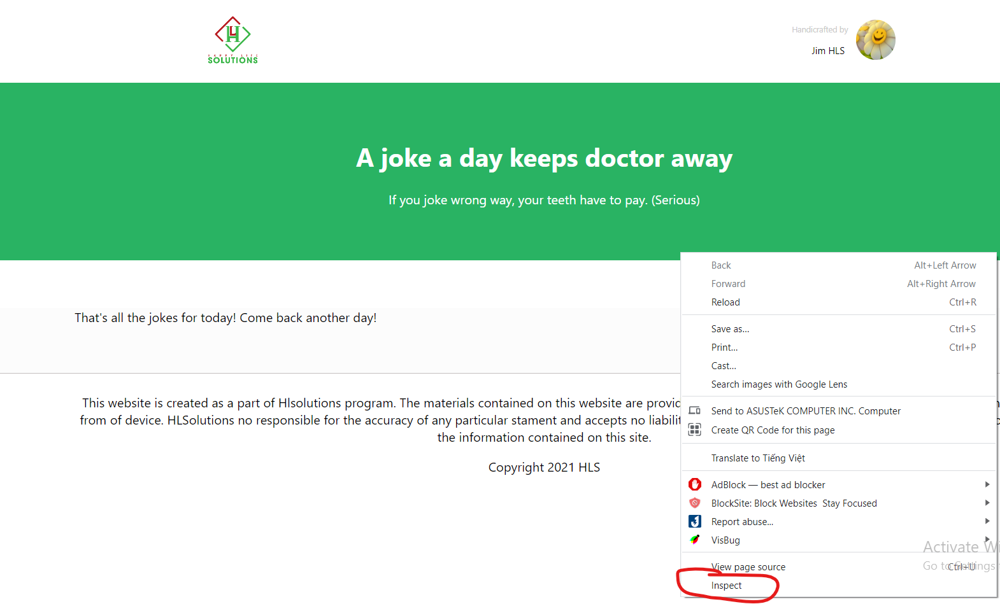
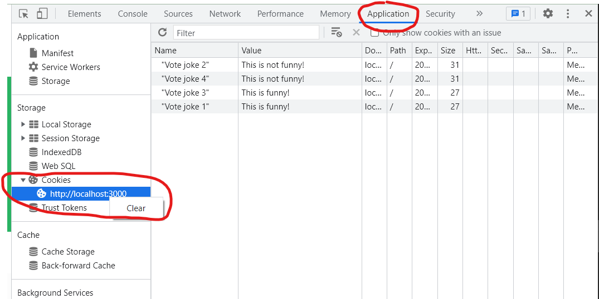

# Using create-react-app

This project was bootstrapped with [Create React App](https://github.com/facebook/create-react-app).

## Available Scripts

In the project directory, you can run:

### `npm install`

You should install npm dependencies for this project.

### `npm start`

Runs the app in the development mode.\
Open [http://localhost:3000](http://localhost:3000) to view it in your browser.

# About this website

This app will display a single joke for the user to read. After reading the joke, the user will like or dislike the joke. The app will record the vote in database and then show another joke for the user to read. When there is no more jokes to show, the app will display a "That's all the jokes for today! Come back another day!" message.

There is no need to display the result of the votes. User should not see the same joke twice. User do not need to register or login to view the joke or vote for the joke.

## Instructions to using this site

You read a joke is available on the screem and you will vote for the joke that is funny or not. In the end of the final joke you can not read another jokes anymore

If you want to read again you have to clear the cookie. If you do not know how to clear the cookie, please follow the image below. Thank you! and have a good mood when you read this jokes.

- In the website click F12 or right-click on the browser tab and select the "Inspect"

- On the right of the screen choosen the Application on tab bar => click on the "Cookies" button and right-click on the mouse choose "clear"

